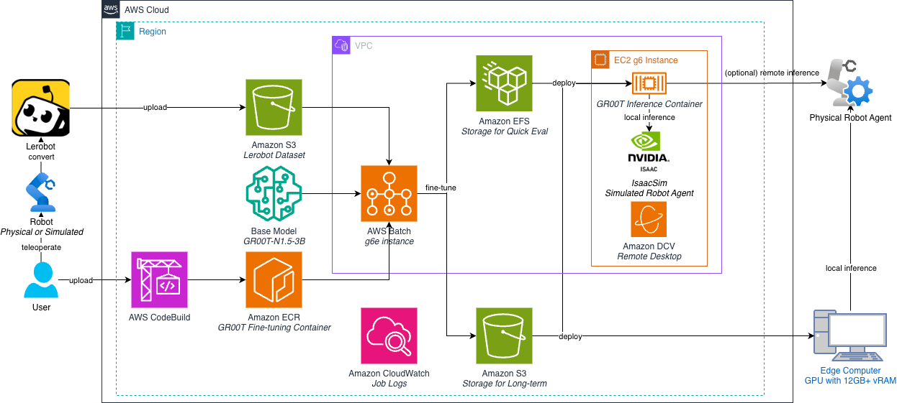

# AWS CDK Stacks for GR00T Fine-tuning

This directory contains AWS Cloud Development Kit (CDK) stacks to deploy infrastructure for fine-tuning and evaluating NVIDIA Isaac GR00T models on AWS.

## Architecture Overview



The infrastructure consists of two independent but complementary CDK stacks:

1. **BatchStack** (`batch_stack.py`) - Creates AWS Batch resources for scalable fine-tuning jobs
2. **DcvStack** (`dcv_stack.py`) - Deploys an Amazon EC2 instance with Amazon DCV for visualization and evaluation

Both stacks can share common resources (VPC, EFS, Security Groups) to enable seamless data flow between training and evaluation workflows.

## Stack Dependencies

### BatchStack
Creates the following resources:
- Amazon VPC with public and private subnets (optional, can import existing)
- Amazon EFS file system for shared storage (optional, can import existing)
- Security group for EFS access
- Amazon ECR repository and container image (or references existing)
- EC2 Launch Template with increased root volume
- AWS Batch Compute Environment (EC2 with GPU instances)
- AWS Batch Job Queue and Job Definition
- IAM roles for Batch instances and job execution

**Dependencies**: None (fully self-contained)

### DcvStack
Creates the following resources:
- Amazon EC2 instance (g6.4xlarge with GPU)
- Amazon DCV server for remote visualization
- Security group for DCV and TensorBoard access
- Elastic IP for stable connectivity
- IAM role for EC2 instance
- Mounts shared EFS file system (if provided)

**Dependencies**: 
- VPC (can import from BatchStack, provide VPC ID, or use existing VPC object)
- EFS and Security Group (optional, for shared storage with Batch jobs)

## Deployment Paths

Choose the path that best fits your environment and requirements:

### Path 1: Fully Automated Deployment (Recommended)

Deploy both stacks automatically with CDK. Works on **any architecture** (x86 or ARM) - the infrastructure automatically handles container building in the cloud when needed.

```bash
# Install dependencies
cd training/gr00t/infra
pip install -r requirements.txt

# Set AWS region for deployment
export AWS_REGION=us-west-2  # or your preferred region

# Bootstrap CDK (one-time per account/region)
cdk bootstrap

# Deploy Batch and DCV stacks (creates VPC, EFS, and Batch resources)
cdk deploy IsaacGr00tBatchStack IsaacLabDcvStack
```

**What happens automatically:**
- If you don't provide an `ecr_image_uri`, the stack will:
  1. Create a CodeBuild project with x86 compute
  2. Build the container image from the Dockerfile in the cloud
  3. Push the image to ECR
  4. Use the built image for Batch jobs
- **Build time**: First deployment takes ~18 minutes for the container build. No need for local x86 Docker or early DCV deployment

**Using an existing container image:**
```bash
# Skip automatic build by providing a pre-built image
cdk deploy IsaacGr00tBatchStack IsaacLabDcvStack \
  --context ecr_image_uri=123456789012.dkr.ecr.us-west-2.amazonaws.com/gr00t-finetune:latest
```

**Using existing AWS resources:**
```bash
# Import existing VPC, EFS, and other resources
cdk deploy IsaacGr00tBatchStack IsaacLabDcvStack \
  --context vpc_id=vpc-12345 \
  --context efs_id=fs-12345 \
  --context efs_sg_id=sg-12345 \
  --context dataset_bucket=my-dataset-bucket \
  --context s3_upload_uri=s3://my-checkpoint-bucket/gr00t/checkpoints
```
#### Monitoring the Build

After deploying, you can monitor the build progress:

```bash
# Get the CodeBuild project name from stack outputs
export PROJECT_NAME=$(aws cloudformation describe-stacks \
  --stack-name IsaacGr00tBatchStack \
  --query 'Stacks[0].Outputs[?OutputKey==`CodeBuildProjectName`].OutputValue' \
  --output text)

# Trigger a build (if not automatically triggered)
aws codebuild start-build --project-name $PROJECT_NAME

# Monitor build logs in real-time
aws logs tail /aws/codebuild/$PROJECT_NAME --follow
```

#### Triggering Manual Rebuilds

To rebuild the container after code changes:

```bash
# Use the build command from stack outputs
aws codebuild start-build --project-name $PROJECT_NAME
```

### Path 2: Manual Console + CDK for DCV

Create AWS Batch resources manually via AWS Console (following the blog walkthrough), then deploy only the DCV stack with CDK.

```bash
# After manually creating VPC, EFS, and Batch resources in the console,
# add their IDs to cdk.json:
cat > cdk.json << EOF
{
  "app": "python app.py",
  "context": {
    "vpc_id": "vpc-xxxxxxxx",
    "efs_id": "fs-xxxxxxxx",
    "efs_sg_id": "sg-xxxxxxxx"
  }
}
EOF

# Set AWS region for deployment
export AWS_REGION=us-west-2  # or your preferred region

# Deploy only the DCV stack
cdk deploy IsaacLabDcvStack
```


## Deployment Context

When deploying the CDK stack, you can configure infrastructure resources using CDK context parameters.

```bash
cdk deploy IsaacGr00tBatchStack IsaacLabDcvStack \
  --context vpc_id=vpc-12345 \
  --context efs_id=fs-12345 \
  --context efs_sg_id=sg-12345 \
  --context ecr_image_uri=123456789012.dkr.ecr.us-west-2.amazonaws.com/gr00t-finetune:latest \
  --context dataset_bucket=my-dataset-bucket \
  --context s3_upload_uri=s3://my-checkpoint-bucket/gr00t/checkpoints
```

### Configuration Options

| Context Parameter | Env Variable | Description | Default |
|------------------|--------------|-------------|---------|
| `vpc_id` | `VPC_ID` | Existing VPC ID to reuse | Creates new VPC |
| `efs_id` | `EFS_ID` | Existing EFS file system ID | Creates new EFS |
| `efs_sg_id` | `EFS_SG_ID` | EFS security group ID (required if `efs_id` is set) | Creates new SG |
| `ecr_image_uri` | `ECR_IMAGE_URI` | Pre-built ECR image URI (in the same region as the deployment) | Automatically builds via CodeBuild |
| `dataset_bucket` | `DATASET_BUCKET` | S3 bucket name for dataset read-only access | No dataset bucket access |
| `s3_upload_uri` | `S3_UPLOAD_URI` | S3 URI for checkpoint uploads | Creates new checkpoint bucket |

**Note**: CDK context parameters take precedence over environment variables. This allows for flexible deployment configurations while maintaining consistency through context values in your `cdk.json` or CLI commands.

### cdk.json

You can also use context in [cdk.json](cdk.json) to provide existing resource IDs to import rather than create new ones:

```json
{
  "app": "python app.py",
  "context": {
    "vpc_id": "vpc-xxxxxxxx",
    "efs_id": "fs-xxxxxxxx",
    "efs_sg_id": "sg-xxxxxxxx",
    "ecr_image_uri": "123456789012.dkr.ecr.us-west-2.amazonaws.com/gr00t-finetune:latest",
    "dataset_bucket": "my-dataset-bucket",
    "s3_upload_uri": "s3://my-checkpoint-bucket/gr00t/checkpoints"
  }
}
```

## Resource Sharing Between Stacks

When both stacks are deployed together, they share:

1. **VPC**: DCV instance and Batch compute nodes run in the same network
2. **EFS**: Mounted at `/mnt/efs` on both DCV instance and Batch containers
3. **Security Group**: Allows both DCV and Batch instances to access EFS

This enables:
- Real-time monitoring of training jobs via TensorBoard on the DCV instance
- Direct access to model checkpoints for evaluation
- Seamless data flow between training and evaluation workflows

## Prerequisites

1. **AWS Account**: With appropriate permissions to create VPC, EC2, EFS, Batch, IAM resources
2. **AWS CLI**: Configured with credentials (`aws configure`)
3. **Node.js**: For AWS CDK CLI (`npm install -g aws-cdk`)
4. **Python 3.8+**: For CDK app and dependencies
5. **Docker**: For building container images (if not using pre-built images)
6. **Service Quotas**: At least 8 vCPUs for "Running On-Demand G and VT instances" in your target region

## Deployment Checklist

- [ ] Install AWS CDK CLI: `npm install -g aws-cdk`
- [ ] Install Python dependencies: `pip install -r requirements.txt`
- [ ] Set AWS region: `export AWS_REGION=us-west-2`
- [ ] Bootstrap CDK: `cdk bootstrap`
- [ ] Request GPU instance quota (g6e.2xlarge or larger)
- [ ] (Optional) Build and push container image to ECR
- [ ] (Optional) Configure cdk.json with existing resource IDs
- [ ] Deploy stacks: `cdk deploy <StackName>`
- [ ] Verify stack outputs for connection details

## Cleanup

To avoid ongoing charges, destroy the stacks in reverse order:

```bash
# Set AWS region for deployment
export AWS_REGION=us-west-2  # or your preferred region

# Destroy DCV stack first (terminates EC2 instance)
cdk destroy IsaacLabDcvStack --force

# Destroy Batch stack (removes Batch resources, EFS, VPC if created by CDK)
cdk destroy IsaacGr00tBatchStack --force
```

**Important**: If you manually created resources or imported existing ones via context, those resources will NOT be deleted by `cdk destroy`. Delete them manually if they were created specifically for this project.

## Troubleshooting

### Container Build Fails
- **Issue**: Building flash-attn takes too long or fails on ARM machines
- **Solution**: The stack automatically uses CodeBuild for cloud-based x86 builds. Check CodeBuild logs for specific errors

**Build fails with "Docker rate limit exceeded":**
- The buildspec.yml includes a Docker registry mirror configuration to avoid rate limits
- If issues persist, authenticate with Docker Hub or use AWS ECR Public

**Build timeout:**
- Default timeout is 2 hours, sufficient for most builds
- Check CloudWatch Logs for specific error messages

**Permission errors:**
- Verify the CodeBuild role has ECR push permissions
- Check that the ECR repository exists and is in the same region

### DCV Connection Issues
- **Issue**: "No session found" error when connecting to DCV
- **Solution**: Wait 10-15 minutes for user data script to complete. Check `/var/log/dcv-bootstrap.summary` for status

### EFS Mount Fails
- **Issue**: EFS not accessible from Batch jobs or DCV instance
- **Solution**: Verify security group allows NFS (port 2049) from itself. Check EFS mount targets are in the correct subnets

### Batch Job Fails to Start
- **Issue**: Job stuck in RUNNABLE state
- **Solution**: Check compute environment has available capacity. Verify launch template and instance types are correct

### Permission Denied Errors
- **Issue**: Job cannot access S3 or ECR
- **Solution**: Verify IAM roles have appropriate policies. For S3, set `DATASET_BUCKET` environment variable

## Support and Contributions

For issues, questions, or contributions, please refer to the main repository README and contribution guidelines.

## Additional Resources

- [AWS Batch User Guide](https://docs.aws.amazon.com/batch/latest/userguide/)
- [AWS CDK Developer Guide](https://docs.aws.amazon.com/cdk/latest/guide/)
- [Amazon DCV User Guide](https://docs.aws.amazon.com/dcv/)
- [Amazon EFS User Guide](https://docs.aws.amazon.com/efs/latest/ug/)
- [NVIDIA Isaac GR00T Documentation](https://github.com/NVIDIA/Isaac-GR00T)
