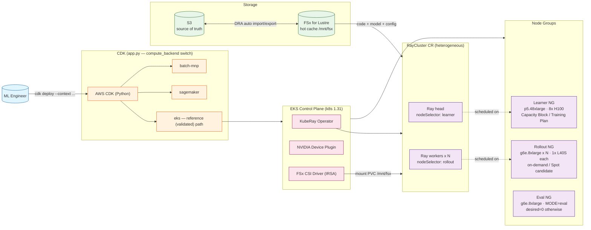
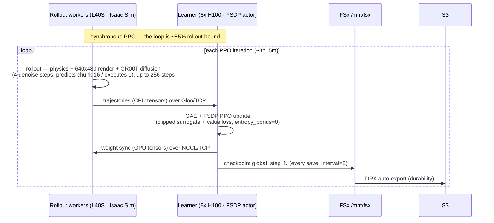
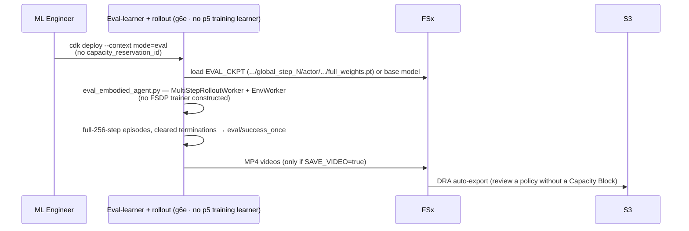
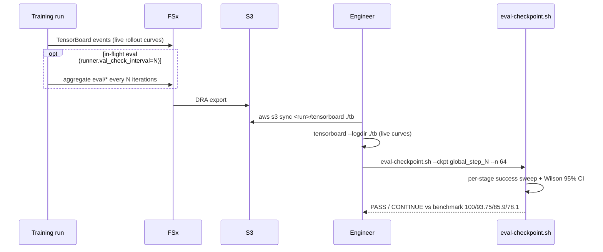

# GR00T RL Post-Training — Architecture & Decision Record

End-to-end architecture for reinforcement-learning post-training of NVIDIA **GR00T N1.5** (3B diffusion Vision-Language-Action policy) on the **Assemble Trocar** task, across three AWS compute backends (`batch-mnp`, `sagemaker`, `eks`). Includes a step-by-step flow and an **architecture-decisions table** documenting why each significant choice was made over its alternative, with sources and quantified impact.

> Pricing cells use a **pricing snapshot retrieved 2026-08-09** (us-east-2; re-verify before budgeting) from the AWS Price List API (p5.48xlarge on-demand `$55.04/hr`, g6e.8xlarge on-demand `$4.53/hr` / spot `~$1.81/hr`). Rates change — re-verify before budgeting.

---

## Architecture Diagram

> **Overview (infra topology).** This shows the **validated deployment profile** (1×p5.48xlarge learner + 8×g6e.8xlarge rollout). Code defaults differ: the learner node group is created **only when `capacity_reservation_id` is supplied** (otherwise train mode brings up an on-demand `g6e.48xlarge` learner), and `num_rollout_workers` defaults to 4. The dynamic flows — training loop, evaluation, and monitoring — are split into their own sequence diagrams in the sections below, so each concern stays readable.



---

## Architecture Flow

### Deployment (steps 1–6)
1. Engineer runs `cdk deploy --context compute_backend={batch-mnp|sagemaker|eks} ...`. `app.py` routes to the matching stack. **`eks` is the reference (validated) path.**
2. The EKS backend provisions the cluster (k8s 1.31) with three node groups: learner (Capacity-Block-backed p5), rollout (g6e ×8), and eval-learner (on-demand, `desired=0` unless `mode=eval`).
3. FSx for Lustre is created and linked to the S3 bucket via a Data Repository Association (DRA). S3 is the source of truth; FSx is the hot cache. `batch_import_meta_data_on_create=True` so FSx sees existing S3 data at boot.
4. KubeRay operator (Helm) reconciles the RayCluster custom resource into a heterogeneous head pod (nodeSelector `node-role: learner`) + 8 worker pods (`node-role: rollout`).
5. The FSx CSI driver mounts the shared PVC at `/mnt/fsx` in every pod.
6. Code, the GR00T model, and the training YAML are read from `/mnt/fsx`.

### Training loop (steps 7–12, synchronous PPO, ~3h15m/iteration)

> Expand each step for the sub-step detail. The loop is **~85% rollout-bound** — steps 7–8 dominate wall-clock; steps 9–12 are the short learner tail.



<details>
<summary><b>7 · Rollout (~2h45m)</b> — each L40S runs 8 parallel Isaac Sim envs: physics + 640×480 render + GR00T diffusion inference (4 denoise steps, action horizon 16). <b>GPU-compute-bound; the p5 learner sits ~idle here (the ~85% sunk idle).</b></summary>

- **7.1 Env reset & domain randomization** — Isaac Sim resets the Assemble Trocar scene (Unitree G1 humanoid + Dex3 hands), applies per-env init randomization, and conditions the policy on the task description (`"install trocar from box"` — the shipped default in `env/isaaclab_assemble_trocar.yaml`, overridable via `--context task_description`).
- **7.2 Observation capture** — each env step renders a 640×480 RGB camera view (GPU rasterization) plus proprioceptive robot state, assembled into GR00T's observation format via the `dex3` obs converter.
- **7.3 Policy inference (GR00T N1.5 diffusion)** — the VLA backbone encodes the obs; the diffusion action head runs **4 denoising timesteps** and predicts an **action chunk of horizon 16**. This RL config sets **`num_action_chunks: 1`** (yaml `actor.model.num_action_chunks`), so **one action is executed per inference** before the next observation.
- **7.4 Action execution & physics** — PhysX advances each env by the executed action before the next inference; episodes run up to **256 steps**.
- **7.5 Reward & staged success** — per-step task reward; `success_once` is tied to `success_stage=4` (final assembly), hardcoded in `g1_assemble_trocar_env_cfg.py`.
- **7.6 Batch accumulation** — sync PPO collects **`rollout_epoch=8`** passes across **64 total envs** (8 L40S nodes × 8 envs/GPU) into one rollout batch before a single learner update — this is why the rollout leg is so long.
- **Binding resource:** L40S GPU compute (physics + render + diffusion). VRAM caps envs/GPU at 8 (16 → OOM), so throughput scales by adding *nodes*, not envs/GPU.
- **Config gotcha (envs/GPU):** `total_num_envs` on the EKS path is set by the entrypoint as `num_rollout_workers × ENVS_PER_WORKER`, and the entrypoint **default `ENVS_PER_WORKER=32`** silently overrides the yaml's designed `total_num_envs: 64` → 256 total = **32 envs/GPU → CUDA OOM** at the Eagle/Qwen3 `lm_head` on the first `predict_action_batch` (co-located sim ~22 GiB + policy logits > 46 GiB L40S). The EKS train path must pass `--context envs_per_worker=8` to honor the 8/GPU ceiling; a bigger rollout GPU (or fewer envs) is the only way past 8/GPU. `PYTORCH_CUDA_ALLOC_CONF=expandable_segments:True` on rollout workers helps fragmentation but does **not** close the 8→32/GPU gap alone.

</details>

<details>
<summary><b>8 · Trajectory transfer (rollout→learner)</b> over <b>Gloo/TCP</b> — trajectories are CPU tensors, so RLinf routes them over Gloo (the GPU weight-sync path uses NCCL — step 10).</summary>

- **8.1 Serialize** — completed trajectories (observations, action chunks, rewards, old log-probs, value targets) are packed per rollout rank.
- **8.2 Transport selection** — RLinf's accelerator gate keys on accelerator **type**, not model: an H100 and an L40S are both `NV_GPU`, so accelerator-CCL (NCCL) stays **enabled** for the group (it is *not* forced to Gloo-only). The **trajectory** payload is explicitly staged to **CPU tensors**, and RLinf routes CPU-device transfers over **Gloo/TCP**; GPU-device transfers (the weight dict, step 10) go over NCCL.
- **8.3 EFA not utilized** — the NCCL path is pinned to TCP sockets (`NCCL_IB_DISABLE=1`, `NCCL_SOCKET_IFNAME=eth0`) and the Gloo path is CPU/TCP, so neither uses libfabric/RDMA; cross-node throughput is capped at the g6e's ~25 Gbps ENA. See [**Why EFA Is Not Utilized**](#special-callout--why-efa-is-not-utilized).

</details>

<details>
<summary><b>9 · Learn (~30m)</b> — the 8-H100 head pod runs FSDP PPO.</summary>

- **9.1 Advantage estimation** — GAE (`adv_type=gae`) computed over the collected trajectories; returns / value targets prepared.
- **9.2 FSDP shard** — GR00T-3B parameters + optimizer state are fully sharded across the 8 H100s; the FSDP all-gather / reduce-scatter runs over **intra-node NVLink/NVSwitch via NCCL**, so EFA (inter-node only) is moot here. (NCCL also carries the cross-node weight-sync in step 10 — but pinned to TCP, see the EFA callout.)
- **9.3 PPO update** — minibatch loop over the configured micro/global batch sizes (see the sync config `isaaclab_ppo_gr00t_assemble_trocar.yaml`): clipped surrogate objective + value loss, across multiple update epochs; approx-KL and clip-fraction tracked. **Entropy regularization is disabled** in this config (`entropy_bonus: 0`).
- **9.4 Optimizer step** — gradient clipping + AdamW step, producing the updated policy and value head.

</details>

<details>
<summary><b>10 · Weight sync (learner→rollout)</b> — updated weights are GPU tensors, so this path uses <b>NCCL, pinned to TCP</b>.</summary>

- **10.1 Consolidate** — updated policy weights gathered on the head pod.
- **10.2 Broadcast** — learner→rollout weight broadcast over NCCL (pinned to TCP via `NCCL_IB_DISABLE=1`) — the `_broadcast` site the included patch hardened against a silent collective deadlock (now fixed upstream, PR #1414).
- **10.3 Reload** — rollout workers load the new weights before the next rollout epoch.

</details>

<details>
<summary><b>11 · Checkpoint</b> — <code>global_step_N</code> written to FSx (<code>save_interval=2</code>).</summary>

- **11.1 Sharded write** — the FSDP checkpoint (sharded `.distcp` shards + consolidated weights) is written to `/mnt/fsx/.../checkpoints/global_step_N`.
- **11.2 Cadence** — `save_interval=2` (every 2 iterations) — the shipped default (yaml `runner.save_interval: 2` + entrypoint `SAVE_INTERVAL:-2`); bounded resume loss ≤2 iters. Lower to `save_interval=1` for per-iteration resumability at higher checkpoint I/O.

</details>

<details>
<summary><b>12 · DRA export</b> — checkpoint auto-exported FSx→S3 for durability.</summary>

- **12.1 Auto-export** — the Data Repository Association exports the new `global_step_N` from FSx back to S3 (the source of truth).
- **12.2 Durability & decoupling** — the S3 copy survives cluster teardown and feeds both standalone evaluation and Capacity-Block-handoff resume.

</details>

### Standalone evaluation (separate deploy)

*Standalone evaluation* means scoring a saved checkpoint in its own short-lived deploy — separate from a training run, and without booking a Capacity Block. `MODE=eval` runs RLinf's built-in embodiment eval driver (`eval_embodied_agent.py`) against a saved checkpoint with **no Capacity-Block p5 training learner** — a small 1-GPU `EvalLearnerNodes` group runs the head instead — so a policy can be reviewed cheaply on g6e-only capacity.



<details>
<summary><b>E1 · Deploy in eval mode</b> — no learner node group.</summary>

- **E1.1** `cdk deploy ... --context mode=eval` with **no** `capacity_reservation_id`; the CDK conditional skips the p5 learner nodegroup entirely.
- **E1.2** Only the on-demand eval-learner node + rollout workers come up — no prepaid p5, no FSDP trainer.

</details>

<details>
<summary><b>E2 · Load checkpoint</b> — resolve the policy to evaluate.</summary>

- **E2.1** `EVAL_CKPT` must be the **actor `.pt` file** (e.g. `.../global_step_N/actor/model_state_dict/full_weights.pt`), not the `global_step_N` directory — the entrypoint validates it with a `-f` file test. Alternatively, evaluate the base snapshot (`nvidia/GR00T-N1.5-3B_Assemble_Trocar`) via `model_path` with `EVAL_CKPT` unset.
- **E2.2** No optimizer/trainer state is loaded — inference weights only.

</details>

<details>
<summary><b>E3 · Rollout-only workers</b> — no FSDP trainer is constructed.</summary>

- **E3.1** `eval_embodied_agent.py` spawns only `MultiStepRolloutWorker` + `EnvWorker` — never the actor/FSDP trainer.
- **E3.2** Consequently `actor.global_batch_size` Hydra overrides are validator-appeasement no-ops in eval mode (they satisfy `validate_embodied_cfg` divisibility without affecting anything consumed).

</details>

<details>
<summary><b>E4 · Success metric</b> — <code>eval/success_once</code>, full-episode reset semantics.</summary>

- **E4.1** RLinf emits `eval/success_once` (tied to `success_stage=4`) at the end of `EmbodiedEvalRunner.run()`.
- **E4.2** Terminations are cleared to zero so **every episode runs the full 256 steps** — the reset-semantics detail that reconciles NVIDIA's benchmark (the `eval_embodied_agent.py` path) with a standalone `eval_assemble_trocar.py` path that ended on termination.

</details>

<details>
<summary><b>E5 · Video capture</b> — MP4 rollouts → FSx → S3.</summary>

- **E5.1** Eval videos are **OFF by default**: the entrypoint sets `++env.eval.video_cfg.save_video=${SAVE_VIDEO:-False}`, overriding the yaml default of `True`. Pass `--context save_video=true` at deploy (plumbed app.py→stack→entrypoint `SAVE_VIDEO`) to write MP4 rollouts to `${LOG_DIR}/video/eval/` on FSx.
- **E5.2** When enabled, DRA auto-exports the videos to S3 for review — a policy can be inspected without ever booking a Capacity Block.

</details>

### Failure handling
- **RLinf collective desync:** a local `_broadcast` raise patch turns a silent Gloo-failure deadlock into a fast failure (now fixed upstream — [PR #1414](https://github.com/RLinf/RLinf/pull/1414)). An auto-recover harness (`scripts/auto-recover.sh`) watches head-pod logs and restarts from the latest `global_step_N` checkpoint via `RESUME_DIR`.
- **Capacity Block handoff:** contiguous blocks require a ~15-min manual CDK re-deploy to rotate the reservation ID — a known operational cost of Capacity-Block-backed capacity. (Persistent, self-healing capacity alternatives could remove this rotation; none is shipped in this repo.)

---

## Monitoring & early-stop (self-serve)

Training is watched — and stopped — with **standard tooling + committed scripts**, no agent or bespoke service required, so anyone reproducing this can gauge a run against NVIDIA's posted benchmark (SFT baseline **83 / 72 / 32 / 29** → RL result **100 / 92 / 85 / 82**, Stages 1–4; measured on 100 scenes, cumulative-stage success). On an N=64 eval path NVIDIA's own RL checkpoint re-measures as **100 / 93.75 / 85.9 / 78.1** — inside the Wilson 95% CI of the posted row — so that N=64 row is the *same-apparatus* reference a per-stage sweep scores against. Three fidelity levels:

| Level | What it shows | Mechanism | Cost |
|-------|---------------|-----------|------|
| 1 · Live rollout curves | `env/success_once`, `env/return`, `train/actor/*`, `train/critic/value_loss` per PPO iter | TensorBoard events on FSx, DRA-exported to S3 | free (already running) |
| 2 · In-flight eval | aggregate `eval/*` streamed into the same TensorBoard every N iters | `runner.val_check_interval=N` config knob (N must divide `save_interval`) | no extra cluster (adds GPU time to the run) |
| 3 · Per-stage benchmark sweep | the exact NVIDIA-comparable 4 numbers + Wilson 95% CI + PASS/CONTINUE verdict | `eval-checkpoint.sh` on a saved checkpoint | one g6e-only eval (self-terminating) |



<details>
<summary><b>M1 · Live curves</b> — the repeatable monitor.</summary>

- **M1.1** The run writes TensorBoard events to FSx; DRA auto-exports them to `s3://<your-bucket>/rl-training/results/<config>_<backend>_train/<timestamp>/tensorboard/`.
- **M1.2** `aws s3 sync <run>/tensorboard ./tb && tensorboard --logdir ./tb` renders them live in a browser — zero custom infra.
- **M1.3** Correctness signal when training **from the SFT base**: `env/success_once` starts **low and rises** (an SFT-quality policy on the stochastic rollout metric). A ~98% start instead means the run loaded an already-RL'd checkpoint, not the SFT base.

</details>

<details>
<summary><b>M1.4 · Reading the cards — the four-question story</b> — what each scalar means and how to tell progress from noise.</summary>

Read the TensorBoard as four questions:

**1 · Is the policy getting better at the task? (headline)**
- `env/success_once` — fraction of rollout episodes completing the full assembly (`success_stage=4`). The headline progress metric — want it **rising**. Noisy early (512 stochastic trajectories per iter); read the trend, not single points. This is the *stochastic training* rate, not the deterministic per-stage eval table (that's M3).
- `env/return` — mean episode return (cumulative reward); tracks success, want it rising.
- `reward` / `rewards` — mean per-step reward.

**2 · Is PPO learning stably? (dynamics)**
- `train/critic/value_loss` — value-function MSE; should settle / trend **down** as the critic calibrates to returns.
- `train/actor/policy_loss` — clipped surrogate objective; **oscillates around 0** by design — check it doesn't explode, not that it descends.
- `train/actor/entropy_loss` (entropy) — policy randomness; high early (exploration), should **decay gradually**. A fast collapse to ~0 = premature convergence (exploration died).
- `train/actor/grad_norm` — gradient magnitude; want it **bounded/stable**; spikes = instability.
- `train/actor/dual_cliped_ratio` — fraction of samples hitting the PPO clip; moderate is healthy, very high = policy moving too fast per update.
- `train/actor/lr` — learning-rate schedule (sanity).

**3 · Is the learning signal sane?**
- `advantages_mean/max/min` — GAE advantages; mean ≈ 0 (normalized), a healthy spread means there's signal to learn from.
- `returns_mean/max/min` — estimated returns feeding the critic.

**4 · Is the sim healthy? (don't skip)**
- `episode_len` — should sit at ~256; a drop means episodes ending early (sim/policy trouble → curves untrustworthy).
- `num_trajectories` — **512** in a training iter, **64** in the `val_check_interval` eval block — tells you which block you're reading.
- `env/interact`, `env/env_interact_step` — env-stepping throughput.

**The one-line read:** `success_once` + `return` climbing = policy improving; `value_loss` easing down with `grad_norm` bounded and `entropy` decaying slowly = healthy PPO; `episode_len ≈ 256` = sim running full episodes, so the curves are trustworthy.

</details>

<details>
<summary><b>M2 · In-flight eval</b> — aggregate eval inside the training loop.</summary>

- **M2.1** `runner.val_check_interval=N` runs eval every N `global_step`s (= outer PPO iterations) and logs aggregate `eval/success_once` to the same TensorBoard. `save_interval` must be divisible by N.
- **M2.2** This is the single-cluster way to watch eval move during training: an EKS training stack can't be in train and eval mode at once (the head pod's mode is fixed at deploy time), so in-flight eval goes through this knob, not a second cluster.

</details>

<details>
<summary><b>M3 · The stop/go signal</b> — per-stage sweep vs the NVIDIA benchmark.</summary>

- **M3.1** `eval-checkpoint.sh --ckpt <global_step_N> --n 64` runs the per-stage `success_stage` sweep (Stages 1–4, N=64, cleared terminations, full 256 steps — the standalone per-stage methodology), reads `eval/success_once` per stage from the FSx-persisted TensorBoard events, computes a Wilson 95% CI per stage, and prints a per-stage table + a **PASS / CONTINUE** verdict against the same-apparatus reference 100 / 93.75 / 85.9 / 78.1 (NVIDIA's RL checkpoint re-measured on this N=64 path; NVIDIA's *posted* headline is **100 / 92 / 85 / 82** on 100 scenes, and the N=64 row sits inside its Wilson 95% CI).
- **M3.2** Comparing two checkpoints (e.g. `global_step_2` vs `_4`) shows the per-stage numbers moving toward NVIDIA's band — the signal for "run longer vs stop." **PASS** = every stage lands in (or above) NVIDIA's CI band; otherwise **CONTINUE**, naming the short stages.
- **M3.3** `eval-checkpoint.sh` runs on `--backend eks` and owns its eval cluster's lifecycle — it tears the eval capacity down on success, on failure, and at a `MAX_RUNTIME` hard-deadline, so a crashed eval never burns GPUs unattended.

</details>

**Early-stop policy:** the wall-clock budget is a **ceiling, not a commitment** — stop when the M3 sweep lands in NVIDIA's Wilson-CI band; resume from the last checkpoint (`RESUME_DIR`/`RESUME_LOG_DIR`) to go longer. A durable hard-deadline watchdog force-scales the fleet to 0 at the ceiling even if the run is left unattended.

---

## Cost snapshot (pricing snapshot retrieved 2026-08-09; us-east-2, re-verify before budgeting)

Per-iteration (~3h15m) and per-~100hr-campaign (~31 iters). **The learner is prepaid (Capacity Block / Training Plan) — its idle is a sunk cost, not a running meter.**

| Component | Qty | $/hr | Per-iter (3.25h) | Per-100hr campaign | Note |
|-----------|-----|------|------------------|--------------------|------|
| p5.48xlarge learner | 1 | $55.04 (on-demand ref) | $178.88 | ~$5,504 | prepaid on Capacity Block; idle during rollout is **sunk** |
| g6e.8xlarge rollout (on-demand) | 8 | $4.53 ea | $117.74 | ~$3,623 | **live meter** — idle during learn is recoverable |
| g6e.8xlarge rollout (**Spot**) | 8 | ~$1.81 ea | ~$47.06 | ~$1,448 | **~60% off → saves ~$2,175/campaign**; rollout is stateless/restartable |
| FSx PERSISTENT_2 1200 GiB | 1 | `$VERIFY` (~$0.29/GiB-mo tier) | — | — | idle-burn component |
| EKS control plane | 1 | ~$0.10 | — | ~$10 | |

**Biggest cost mover:** Spot the rollout fleet (~$2.2k/campaign saved). The prepaid p5 idle is sunk, so scheduling `MODE=eval` work during an otherwise-idle Capacity-Block window is free utility (it runs on the g6e eval-learner, not the p5).

---

## Architecture decisions and trade-offs

Each row: the choice, the rejected alternative, why it won, an authoritative source (public code, upstream issue/PR, or AWS docs where one applies), and the quantified impact/limit.

### 1 · Compute

| Decision | Chosen ▸ Rejected | Why | Source | Impact / limit |
|----------|-------------------|-----|--------|----------------|
| Learner GPU | **p5.48xlarge (8×H100)** ▸ g6e.48xlarge (8×L40S) | H100 far faster on the PPO step; single node keeps FSDP on NVLink | observed in our validation (sample figures, not a reproducible public benchmark) | PPO step **30 min (H100) vs 3h50m (L40S) = 7.7×** |
| Learner topology | **Single 8-GPU node** ▸ multi-node FSDP | avoids cross-node NCCL + RAM-OOM at init; NVLink all-reduce | — | 8 FSDP shards, gbs 2048 |
| Rollout instance | **g6e.8xlarge (256GB)** ▸ g6e.4xlarge (128GB) | g6e.4xlarge's 128 GB RAM OOM'd the rollout worker during validation | — | 128GB OOM → 256GB safe |
| H100 procurement | **EC2 Capacity Blocks** ▸ on-demand p5 | on-demand p5 was not reliably available in the target Region/AZ during validation | [Capacity Blocks](https://docs.aws.amazon.com/AWSEC2/latest/UserGuide/ec2-capacity-blocks.html) | **prepaid**; block handoff = ~15 min manual re-deploy |
| GPU AMI | **AL2023_X86_64_NVIDIA** ▸ AL2 GPU / Bottlerocket | AL2023 = driver 580 + CUDA 13; device plugin Helm-installed | [EKS optimized accelerated AMI](https://docs.aws.amazon.com/eks/latest/userguide/eks-optimized-ami.html) | device plugin not bundled → must Helm-install |
| Rollout Spot | **Deferred, candidate** ▸ Spot now / Spot-for-MNP | rollout stateless/restartable = Spot-safe; MNP Spot out-of-scope (gang-schedule reclaim kills job) | [Karpenter+Spot](https://aws.amazon.com/blogs/containers/using-amazon-ec2-spot-instances-with-karpenter/) | **~60% off** ($4.53→~$1.81/hr snapshot) |

<details>
<summary><b>1.1 · Learner instance sizing — the formula, and why p5</b></summary>

**Was p5 picked "just because it didn't OOM"?** No — it's reference-parity + throughput + activation headroom. There *is* a sizing formula, but it only covers the easy half.

**Static (model states) — computable:**
```
M_states ≈ P × 16 bytes   (fp16 weights 2 + grads 2 + Adam m/v 8 + fp32 master 4)
        = 3e9 × 16 = 48 GB   →  FSDP shards across N GPUs → 48/N GB/GPU (~6 GB on 8 GPUs)
```
By this alone a 3B model is tiny — it'd fit almost anywhere. So the static formula is necessary but **not** the deciding factor.

**Dynamic (activations) — the real driver, config-dependent, not a clean formula:**
For a VLA the peak is activations, and they spike: vision tokens (640×480 patch embeddings), the Eagle/Qwen3 backbone, the diffusion head, and the killer — the `lm_head` **logits tensor** `= batch × seq × vocab`, which measured **~30.7 GiB for one micro-batch at mbs=128**. That allocation **OOM'd the 48 GB L40S at mbs=128**, requiring **mbs=32 + gradient checkpointing** there; the 80 GB H100 ran **mbs=128 without gradient checkpointing** (both observed in our validation — sample figures, not a reproducible public benchmark). Gradient checkpointing trades compute to shrink this.

**Selection rule:** `aggregate_GPU_mem ≥ M_states + peak_activation × margin`, where `peak_activation` depends on batch size, token count, denoise steps, and checkpointing — so an **empirical "does it OOM at *this* config" check is genuinely required**, not laziness.

**Why p5.48xlarge specifically:** (1) it's the **reference hardware** NVIDIA benchmarked on (removes a repro variable); (2) **throughput** — 8×H100 on NVLink makes the PPO learn-step **~30 min vs ~3h50m on L40S** (the PPO-step row above); (3) **headroom** for the activation spikes above (80 GB/GPU — it ran mbs=128 successfully, whereas the 48 GB L40S needed mbs=32).

**Unvalidated alternatives (not benchmarked on this workload — pricing snapshot, us-east-2 on-demand, 2026-08-09; re-verify. Capacity-Block rates ~25% lower):**

These are *candidates for trading cost against the reference*, sized **by the formula above, not measured** on this task. Empirically validate any chosen box at the target `mbs` before a long run — do not assume it fits the activation spike.

| Instance | GPUs | VRAM/GPU (agg) | $/hr | vs p5 | FSDP interconnect | Fits the spike? (by formula, unverified) |
|----------|------|----------------|------|-------|-------------------|-----------------|
| **p5.48xlarge** (current) | 8×H100 | 80 GB (640) | $55.04 | — | NVLink | validated: mbs=128 tight, mbs=32 easy |
| p5en.48xlarge | 8×H200 | 141 GB (1128) | $63.30 | **+15%** | NVLink | most headroom, but pricier |
| g6e.48xlarge | 8×L40S | 48 GB (384) | $30.13 | **−45%** | PCIe (no NVLink) | formula: ok at mbs=32; slower FSDP all-gather |
| p4d.24xlarge | 8×A100 | 40 GB (320) | $21.96 | **−60%** | NVLink | formula: mbs=32 plausible; 40 GB tight for mbs=128 — unverified |
| p4de.24xlarge | 8×A100 | 80 GB (640) | *n/a in us-east-2* | — | NVLink | same VRAM as p5, but not offered here |

Notes on the candidates (all **unverified on this workload**): **p4d.24xlarge (−60%)** keeps NVLink FSDP throughput (A100) and by the sizing formula should fit mbs=32 (6 GB sharded states + ~7.7 GB logits + activations against 40 GB), but A100 is ~2–3× slower than H100 — since the learn phase is only ~15% of the loop the E2E impact would likely be modest, though this has not been measured. **g6e.48xlarge (−45%)** is the codebase *default* learner and has more VRAM headroom (48 GB) but L40S over PCIe makes FSDP comms slower. **p4de (A100 80 GB)** would be the ideal cheaper drop-in (same VRAM as p5) but isn't offered in us-east-2.

</details>

### 2 · Orchestration

| Decision | Chosen ▸ Rejected | Why | Source | Impact / limit |
|----------|-------------------|-----|--------|----------------|
| Heterogeneous backend | **EKS + KubeRay** ▸ SageMaker heterogeneous / Batch MNP | SageMaker VPC-mode blocks EFA on multi-GPU heterogeneous; Batch MNP homogeneous-only | `infra/eks_kuberay_stack.py` | enables p5+g6e on one cluster |
| Ray lifecycle | **KubeRay CR** ▸ manual `ray start` | declarative; removes ~200 lines of IP-discovery from the Batch entrypoint | [KubeRay docs](https://docs.ray.io/en/latest/cluster/kubernetes/index.html) | delegates to `$KUBERAY_GEN_RAY_START_CMD` |
| GPU scheduling | **k8s device plugin** ▸ CUDA_VISIBLE_DEVICES / DRA driver | isolation + placement; k8s DRA needs 1.34 (we're on 1.31) | `infra/eks_kuberay_stack.py` | pods Pending if plugin missing |

### 3 · Storage

| Decision | Chosen ▸ Rejected | Why | Source | Impact / limit |
|----------|-------------------|-----|--------|----------------|
| Shared FS | **FSx for Lustre** ▸ EFS | native S3↔FSx DRA sync, high-throughput multi-reader I/O for model/config load + sharded-checkpoint write. NOTE: our validation stayed **GPU-compute-bound** — FSx did not measurably speed the rollout step itself vs the loading/checkpoint paths | observed in our validation (sample figures, not a reproducible public benchmark) | EFS ~100 MB/s vs FSx ~1+ GB/s on load/checkpoint I/O |
| FSx tier | **PERSISTENT_2** ▸ SCRATCH_2 | persistence/durability for long runs + checkpoint safety (SCRATCH data is not replicated). NOTE: DRA is NOT the differentiator — only the `scratch_1` deployment type is excluded from DRA; SCRATCH_2 supports it | [AWS FSx DRA docs](https://docs.aws.amazon.com/AWSCloudFormation/latest/TemplateReference/aws-resource-fsx-datarepositoryassociation.html) | ~3.6% cost premium; 250 MB/s/TiB |
| Source of truth | **S3 + DRA auto-import** ▸ FSx as primary | S3 durable; FSx ephemeral cache; checkpoints auto-export | — | S3 must be same region as FSx |
| DRA import | **batch_import_meta_data_on_create=True** ▸ default | else FSx appears empty despite S3 data | [AWS FSx DRA docs](https://docs.aws.amazon.com/AWSCloudFormation/latest/TemplateReference/aws-resource-fsx-datarepositoryassociation.html) | avoids boot "file not found" |

### 4 · Networking / Transport

| Decision | Chosen ▸ Rejected | Why | Source | Impact / limit |
|----------|-------------------|-----|--------|----------------|
| **EFA utilization** | **EFA NOT enabled (TCP)** ▸ enable EFA/RDMA | see dedicated callout below | [Why EFA Is Not Utilized](#special-callout--why-efa-is-not-utilized) | cross-node paths capped at NIC TCP (g6e **25 Gbps**), no RDMA benefit as-is |
| NCCL config | **`NCCL_IB_DISABLE=1`, `eth0`** ▸ IB/RDMA path | no EFA on Batch MNP; forces TCP sockets | — | RDMA off |
| Heterogeneous transport | **Gloo for CPU trajectories, NCCL for GPU weight-sync** ▸ Gloo-only | RLinf's gate keys on accelerator **type** (H100+L40S both `NV_GPU`) so NCCL stays enabled; only the CPU-staged trajectory payload uses Gloo | [`multi_channel_pg.py`](https://github.com/RLinf/RLinf/blob/649e7579/rlinf/scheduler/collective/multi_channel_pg.py) | NCCL pinned to TCP (`NCCL_IB_DISABLE=1`); it is NOT forced Gloo-only for two NVIDIA GPUs |
| Rollout scaling axis | **more nodes (horizontal)** ▸ more envs/GPU | Isaac Sim env-process VRAM caps density | — | **8 envs/GPU safe (~28GB), 16 OOMs (~34GB)** on 48GB L40S; us-east-2 384 vCPU wall |
| Async ceiling | **accept ~15%, don't chase now** ▸ GPU-parallel-sim async now | 85% rollout-bound; async masks only the 30m learn | — | ceiling ≈30m/3h15m ≈**15%**; a GPU-parallel-sim async experiment **regressed −4.46%** |

### 5 · Framework / Model

| Decision | Chosen ▸ Rejected | Why | Source | Impact / limit |
|----------|-------------------|-----|--------|----------------|
| RLinf version | **pin `649e7579` + `_broadcast` patch** ▸ newer/main | pin doesn't need weight_syncer; upgrade queued for native async PPO | [RLinf](https://github.com/RLinf/RLinf) | async PPO landed [PR #654](https://github.com/RLinf/RLinf/pull/654) ~3wk after pin |
| PPO mode | **synchronous** ▸ async now | RLinf pin async is SAC-only (`train_async.py` raises for PPO) | — | native async = bounded-staleness + off-policy correction (queued upgrade) |
| Rollout pipelining | **`pipeline_stage_num: 1`** (shipped) ▸ `2` (future, untried) | the sync yaml ships `1`; `2` is a proposed on-policy-safe speedup with possible VRAM relief — **not implemented/validated here** | — | `2` bounded by the ~15% async ceiling if ever tried |
| FSDP config | **sync default mbs 32 + grad-ckpt (all learners)** ▸ larger mbs no ckpt | the sync entrypoint defaults mbs=32/grad-ckpt=True regardless of GPU (L40S-safe); the H100 benchmark used **mbs=128 via an explicit `MICRO_BATCH_SIZE=128` override** — there is no automatic H100 auto-select | `docker/entrypoint-eks.sh:132-143` | H100 (mbs128) ~30 min vs L40S (mbs32) ~3h50m |
| cpu_offload | **disabled** ▸ enabled | NCCL deadlock at FSDP init | — | confirmed deadlock |
| torch.compile | **disabled** ▸ enabled | deadlocks with Isaac Sim multi-GPU | — | `TORCHDYNAMO_DISABLE=1` |
| Container | **single unified image** ▸ separate learner/rollout | RLinf colocate needs all deps in one image | — | flash-attn compiled on GPU box, not CodeBuild |

### 6 · Reliability / Cost

| Decision | Chosen ▸ Rejected | Why | Source | Impact / limit |
|----------|-------------------|-----|--------|----------------|
| Checkpoint cadence | **save_interval=2** (shipped) ▸ =1 | frequent checkpointing for resumability; =1 (every iter) trades I/O for tighter recovery | — | bounded resume loss ≤2 iters |
| Collective fix | **local `_broadcast` raise** ▸ unpatched | early validation exposed a collective-desynchronization failure (silent Gloo-failure → uninitialized-memory deadlock); the included patch converts it to a fast failure (fixed upstream, [PR #1414](https://github.com/RLinf/RLinf/pull/1414)) | [issue #1378](https://github.com/RLinf/RLinf/issues/1378) | ~3hr watchdog latency before the patch |
| Between-experiment | **scale nodegroups to 0, keep EKS+FSx** ▸ destroy cluster | idle burn tiny; teardown risks CB re-acquisition. NOTE: the CDK stack fixes rollout min/desired to `num_rollout_workers` — scaling to 0 is an **out-of-band operational action** (e.g. via the eval helper), which creates CloudFormation drift | — | **idle ~$0.50/hr** |
| Recover learner idle | **run MODE=eval while the p5 CB window is otherwise idle** ▸ de-provision learner | prepaid p5 capacity → scaling it to 0 saves **$0**. NOTE: `MODE=eval` runs the eval head on the g6e eval-learner group, so it does NOT itself consume the p5 — the recovery is "use the paid window for eval work," not "backfill the p5 GPUs" | — | p5 idle **~85%/iter** is sunk |
| Convergence | **patience (plateau 10 after min 15)** ▸ fixed step count | distributed RL not linear; 200×3.25h≈650h extrapolation wrong | — | targets 100/92/85/82% |
| Lifecycle decoupling | **defer to async milestone** ▸ S3+SQS now | under sync PPO learner still waits for all trajectories; RLinf framework change | — | only pays off with async |

---

## Special Callout — Why EFA Is Not Utilized

**The instances ARE EFA-capable** — p5.48xlarge exposes 32 EFA interfaces, g6e.8xlarge exposes 1 ([`describe-instance-types`](https://docs.aws.amazon.com/AWSEC2/latest/UserGuide/efa.html), us-east-2). Yet this deployment does not enable EFA, and turning it on gives little benefit **as configured**. Reasons:

1. **NCCL is deliberately pinned to TCP sockets.** The GPU collectives — the cross-node learner→rollout weight-sync (step 10) and the intra-node FSDP all-gather/reduce-scatter — use NCCL, but the stack sets `NCCL_IB_DISABLE=1` + `NCCL_SOCKET_IFNAME=eth0`, forcing NCCL onto the ENA TCP path instead of libfabric/EFA RDMA. Using EFA would require removing that pin and wiring the EFA device plugin.
2. **The trajectory transfer is Gloo over CPU tensors, which can't use RDMA anyway.** RLinf explicitly stages the `Trajectory` payload to CPU tensors and routes CPU-device transfers over Gloo/TCP. NOTE: the heterogeneity gate keys on accelerator *type*, and H100 + L40S are both `NV_GPU`, so accelerator-CCL (NCCL) stays **enabled** for the group — it is **not** forced Gloo-only; only the CPU-tensor path is Gloo. Source: [`multi_channel_pg.py`](https://github.com/RLinf/RLinf/blob/649e7579/rlinf/scheduler/collective/multi_channel_pg.py).
3. **The learner is a single node — intra-learner FSDP is NVLink/NVSwitch (on-node), and EFA is inter-node only.** There is no multi-node *learner* NCCL path to accelerate.

**Throughput impact (limited-to vs could-have):**
- **Limited to:** cross-node transport — NCCL weight-sync + Gloo trajectory transfer — rides the **g6e.8xlarge's single 25 Gbps ENA card** ([`describe-instance-types`](https://docs.aws.amazon.com/AWSEC2/latest/UserGuide/ec2-instance-network-bandwidth.html)), because NCCL is TCP-pinned and Gloo can't use RDMA.
- **Could have had (if EFA enabled):** EFA on g6e.8xlarge would **not raise peak bandwidth** (still a 25 Gbps NIC) but would add **RDMA / OS-bypass** to the NCCL weight-sync path, cutting per-message latency + CPU overhead and improving scaling as rollout node count grows. It would **not** help the Gloo trajectory path. The p5's 3200 Gbps fabric only matters for a *multi-node learner*, which this does not run.
- **Net:** enabling EFA is a config/topology change (remove the NCCL TCP pin, add the EFA plugin), not a one-line CDK flag, and the payoff is marginal here — the path is **bounded by 25 Gbps TCP** but acceptable because rollout is **compute-bound (~2h45m of GPU work)**, not network-bound (trajectories transfer only at the rollout tail).
